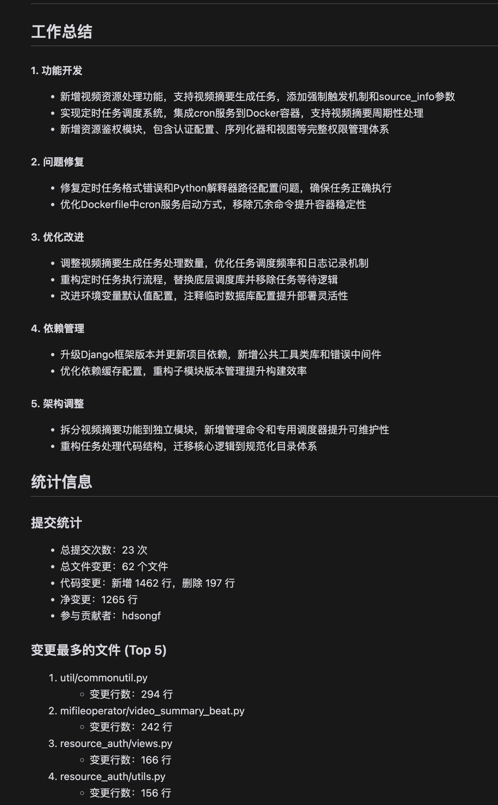

# Git Work Report Generator

English | [简体中文](./README.md)

A VSCode extension that automatically generates work reports based on Git commit history, supporting daily, weekly, monthly, and quarterly reports.

## Features

- Multiple report types (daily/weekly/monthly/quarterly)
- Auto-scan Git repositories in subfolders
- AI-powered work summary generation
- Automatic code change statistics
- Custom date range support
- Custom prompt template support

## Configuration

### Required Settings

```json
{
    "weeklyReport.openai.apiKey": "your-api-key",  // OpenAI API Key
    "weeklyReport.repositories": [
        {
            "path": "/root/dylan/plugin/",  // Git repository path (will scan subfolders)
        }
    ]
}
```

### Optional Settings

```json
{
    "weeklyReport.reportType": "weekly",  // 报告类型：daily/weekly/monthly/quarterly
    "weeklyReport.openai.baseUrl": "https://api.deepseek.com",  // API 基础 URL
    "weeklyReport.openai.model": "deepseek-reasoner",  // 使用的模型 v3模型deepseek-chat
    
}
```

## Usage

1. Configure required parameters (API Key and repository path). Use deepseek's API key (lots of free quota, just register one), other models to be verified
2. Use shortcut `Cmd+Shift+G` (Mac) / `Ctrl+Shift+G` (Windows/Linux) to generate report
3. Or click the report generator icon in the activity bar and select report type

## Report Types

- Daily: Work content of the current day
- Weekly: Work content from Monday to current day (default)
- Monthly: Work content from the beginning of the month to current day
- Quarterly: Work content from the beginning of the quarter to current day

## Output Example


Generated report includes:
1. Work content summary (AI-generated)
2. Statistics
   - Number of commits
   - Number of file changes
   - Code line changes
   - Contributor information
   - Most changed files

## FAQ

Q: Cannot get Git commit records?  
A: Check if repository path is correct and has .git folder

Q: Generated report is empty?  
A: Check if there are commits in the date range, or try adjusting the date range

# Future Plans

- Support weekly statistics for monthly and quarterly reports
- Support custom time ranges.
```
"weeklyReport.customRange": {  // Custom date range (optional)
        "from": "2024-01-01",
        "to": "2024-01-08"
    },
``` 
- Support custom prompt templates and output path settings.
- Support more AI models.


## License

MIT
